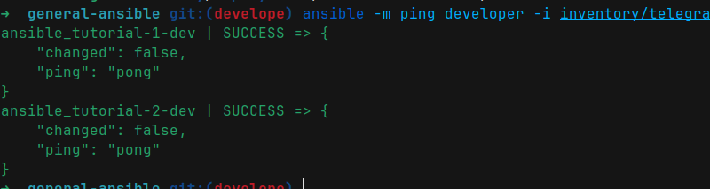
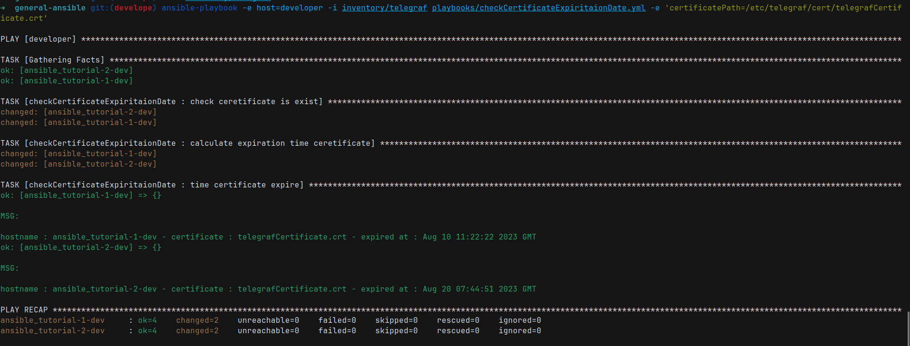

# check certificate expiration date playbook


### Description

when you want to check certificates in many virtual machine at the same directory , you can use this ansible to check certificate expiration  

----

### how to use ??

#### pre requirement

if you didn't install ansible or didn't generate keys or something else please read `README.md` file in 
[Tutorial ansible](https://github.com/moeintavakoli/ansible)


#### step 1 --> edit your inventory

you can create or edit an inventory to define your hosts to check into them 

you can easily define your inventory in  `inventory/sample_inventory` and update hosts in group : `group_name` 

  - `HOSTNAME` : hostname virtual machine
  - `IP` : IP virtual machine OR domain in dns server OR domain in /etc/hosts      
  - `USERNAME` : username on virtual machine that you can ssh on it 
  - `PORT_SSH` : port ssh on virtual machine (default is 22) 

#### step 2 --> check connection to your inventory and group 

There many ways to check connection but easy way to check connection is use `ping` option

`ansible -m ping group_name -i /path/to/inventory` 

like 

`ansible -m ping group_name -i inventory/sample_inventory`




#### step 3 --> run ansible with specific vars

fill the vars 

  - `host` : group hosts that you define in your inventory
  - `certificatePath`: path certificate that you want to check expiration date  


```bash
ansible-playbook playbooks/checkCertificateExpiritaionDate.yml \
        -i /path/to/inventory \
        -e host=group_inventory \
        -e 'certificatePath=/path/to/certificate.crt'
```

like 

```bash
ansible-playbook playbooks/checkCertificateExpiritaionDate.yml \
        -i inventory/sample_inventory  \
        -e host=developer \
        -e 'certificatePath=/etc/telegraf/cert/telegrafCertificate.crt'
```


