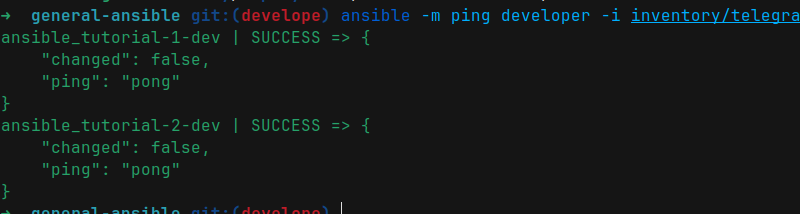

# Update certificate playbook


### Description

When you want to update (replace) certificate files in many virtual machine , you can use this ansible.

----

### how to use ??

#### pre requirement

if you didn't install ansible or didn't generate keys or something else please read `README.md` file in 
[Tutorial ansible](https://github.com/moeintavakoli/ansible)


### step 1 --> edit your inventory

you can create or edit an inventory to define your hosts to check into them 

you can easily define your inventory in  `inventory/sample_inventory` and update hosts in group : `group_name` 

  - `HOSTNAME` : hostname virtual machine
  - `IP` : IP virtual machine OR domain in dns server OR domain in /etc/hosts      
  - `USERNAME` : username on virtual machine that you can ssh on it 
  - `PORT_SSH` : port ssh on virtual machine (default is 22) 

### step 2 --> check connection to your inventory and group 

There many ways to check connection but easy way to check connection is use `ping` option

`ansible -m ping group_name -i /path/to/inventory` 

like 

`ansible -m ping group_name -i inventory/sample_inventory`




### step 3 --> run ansible with specific vars

fill the vars 

  - `host` : group hosts that you define in your inventory
  - `remote_cert_path` : path certificate in remote machine that you want to update (replace) it 
  - `certificate_name` : certificate name in control machine that you want to send it into remote machines . this certificate located in  **roles/updateCertificate/tasks/templates/** . 
  
    For example, if you want to update **nginx.crt**, you must copy this certificate to **roles/updateCertificate/tasks/templates/** and then specify the file name **nginx.crt** when running the playbook to send and replace it.

```bash
ansible-playbook playbooks/updateCertificate.yml \
        -i inventory/sample_inventory \
        -e host= \
        -e 'remote_cert_path=' \
        -e 'certificate_name=' \
        --ask-become-pass
```

like 

```bash
ansible-playbook playbooks/updateCertificate.yml \
        -i inventory/sample_inventory  \
        -e host=developer \
        -e 'remote_cert_path=/etc/nginx/certs/' \
        -e 'certificate_name=certificate.crt' \
        --ask-become-pass
```